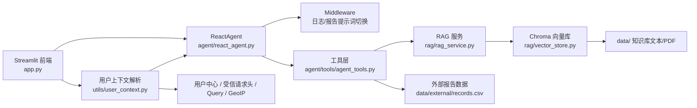

# 智扫通机器人智能客服

一个面向扫地机器人/扫拖一体机器人场景的垂直领域智能客服原型系统。项目以 Streamlit 提供对话界面，结合 LangChain/LangGraph Agent、RAG 检索、DashScope 模型和用户上下文解析能力，支持知识问答、维护建议、故障排查与个人使用报告生成。

## 项目定位

这个项目可以被包装成一个“设备售后与用户服务智能助手”原型，适合用在以下场景：

- 扫地机器人用户自助问答
- 售后服务与维护保养建议
- 个性化使用报告生成
- 垂直知识库问答系统演示
- Agent + RAG + 用户中心接入方案展示

## 核心亮点

- 垂直领域明确：围绕扫地机器人使用、保养、故障排查与报告生成设计
- 链路完整：包含前端界面、Agent、RAG、外部数据、日志与配置
- 双模式运行：支持 `mock` / `real` 两种工具模式，便于演示与联调切换
- 用户上下文能力：支持 `userinfo`、受信请求头、query 参数和 IP 定位回退
- 可扩展性强：用户中心、反向代理、提示词、知识库与外部报告数据都可独立替换
- 演示友好：仓库内置 demo 用户中心与本地测试工具，方便快速走通全链路

更多对外展示文案可参考 [PROJECT_HIGHLIGHTS.md](E:\SoftData\PythonCodes\PythonProject3\docs\PROJECT_HIGHLIGHTS.md)。

## 演示截图

主应用界面：


## 典型能力

- 聊天式客服界面，支持流式输出与会话历史
- 基于本地知识库的 RAG 检索与摘要回答
- 报告链路支持结合用户上下文读取个人使用记录
- 支持天气、当前月份、用户位置等辅助工具
- 应用启动时会进行运行时检查，提前暴露配置缺失和依赖问题
- 支持最小 `/api/me` 用户中心联调

## 架构概览



## 项目结构

```text
app.py                     Streamlit 入口
agent/                     Agent、工具与中间件
rag/                       检索与向量库构建
model/                     模型与 embedding 工厂
config/                    YAML 配置
prompts/                   提示词模板
data/                      知识库文本与外部报告数据
services/                  demo 用户中心与测试代理
utils/                     配置、日志、文件与运行检查工具
artifacts/                 说明材料与截图
docs/                      项目亮点与展示文档
```

## 快速开始

### 1. 安装依赖

```bash
pip install -r requirements.txt
```

### 2. 设置环境变量

推荐先参考 `.env.example`。

PowerShell 示例：

```powershell
$env:DASHSCOPE_API_KEY="your_api_key"
$env:AGENT_TOOL_MODE="mock"
```

必需变量：

- `DASHSCOPE_API_KEY`

常用变量：

- `AGENT_TOOL_MODE`
  - `mock`：适合本地演示
  - `real`：适合联调真实上下文
- `AGENT_MOCK_USER_ID`
- `AGENT_MOCK_USER_LOCATION`
- `AGENT_MOCK_MONTH`
- `AGENT_CURRENT_MONTH`

### 3. 启动应用

```bash
streamlit run app.py
```

默认地址：

```text
http://localhost:8501
```

## 用户上下文能力

应用会在入口层解析 `user_context`，并透传给 Agent 和工具层。当前支持的来源优先级如下：

1. `userinfo` 接口
2. 受信请求头
3. query 参数（仅建议开发环境使用）
4. IP 定位补城市

相关配置位于 [agent.yml](E:\SoftData\PythonCodes\PythonProject3\config\agent.yml) 的 `user_context` 段。

说明：

- `get_user_id`、`get_user_location` 在 `real` 模式下优先从请求上下文解析
- 报告类能力要求当前会话具备有效用户身份
- GeoIP 仅作为城市推断兜底方案，不是高精度定位

## 本地联调方式

### 方式一：query 参数开发联调

适合快速验证上下文链路：

```text
http://localhost:8501/?user_id=1001&city=%E5%8C%97%E4%BA%AC
```

前提是 [agent.yml](E:\SoftData\PythonCodes\PythonProject3\config\agent.yml) 中启用了：

```yaml
allow_query_param_context: true
```

### 方式二：demo 用户中心 `/api/me`

仓库内置了最小可运行用户中心：

```bash
python services/user_center_demo.py
```

默认监听：

```text
http://127.0.0.1:9000/api/me
```

示例 token 在 [user_center_demo.yml](E:\SoftData\PythonCodes\PythonProject3\config\user_center_demo.yml)：

- `demo-token-1001`
- `demo-token-1002`

示例调用：

```powershell
Invoke-WebRequest `
  -Uri "http://127.0.0.1:9000/api/me" `
  -Headers @{ Authorization = "Bearer demo-token-1001" }
```

### 方式三：受信请求头模拟

仓库内提供了本地头注入测试代理：

```bash
python services/header_proxy_demo.py
```

它会把请求转发到 `http://127.0.0.1:8501`，并自动注入：

- `X-User-Id: 1001`
- `X-User-City: 北京`

说明：

- 该代理更适合做接口/链路验证
- 由于 Streamlit 对反向代理和 WebSocket 较敏感，完整浏览器代理联调可能仍需 nginx/caddy 等成熟代理

## 启动前检查

应用启动时会自动检查：

- `config/*.yml` 是否存在
- 提示词文件是否存在
- `DASHSCOPE_API_KEY` 是否设置
- 知识库目录、外部报告数据是否可用
- `AGENT_TOOL_MODE` 是否有效
- `pypdf` 是否安装
- `real` 模式下是否配置了可用的用户上下文来源

如果存在阻塞性错误，页面会直接显示原因并停止启动。

## 知识库初始化

如果你修改了 `data/` 下的知识库文件，可以手动重建向量库：

```bash
python rag/vector_store.py
```

说明：

- 会扫描 [chroma.yml](E:\SoftData\PythonCodes\PythonProject3\config\chroma.yml) 中配置的 `data_path`
- 当前支持 `txt` 和 `pdf`
- 文档去重依赖 `md5.text`

## Docker 运行

```bash
docker build -t robot-agent .
docker run -p 8501:8501 -e DASHSCOPE_API_KEY=your_api_key robot-agent
```

## 适合怎么展示

如果你要拿这个项目做展示，推荐这样讲：

- 这是一个面向扫地机器人售后与用户服务场景的垂直领域智能客服原型
- 技术上融合了 Agent、RAG、结构化外部数据和用户上下文解析
- 不仅能做知识问答，还能生成与当前用户相关的个性化使用报告
- 具备从 demo 过渡到真实业务系统的接入思路，例如 `/api/me`、受信请求头和反向代理集成

## 当前已知限制

- 浏览器原生地理定位尚未接入，城市解析主要依赖用户档案、请求头或 IP 定位
- 外部报告数据目前仍来自本地 `data/external/records.csv`
- 知识库初始化链路还有进一步工程化空间
- 自动化测试仍较少，更适合原型演示与功能联调
